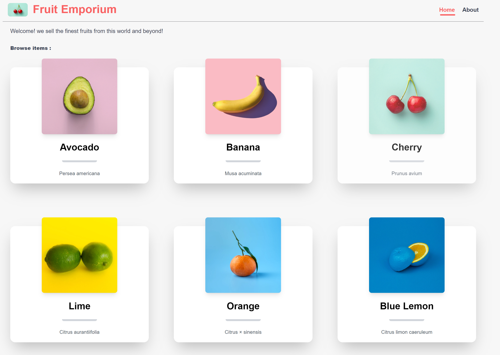
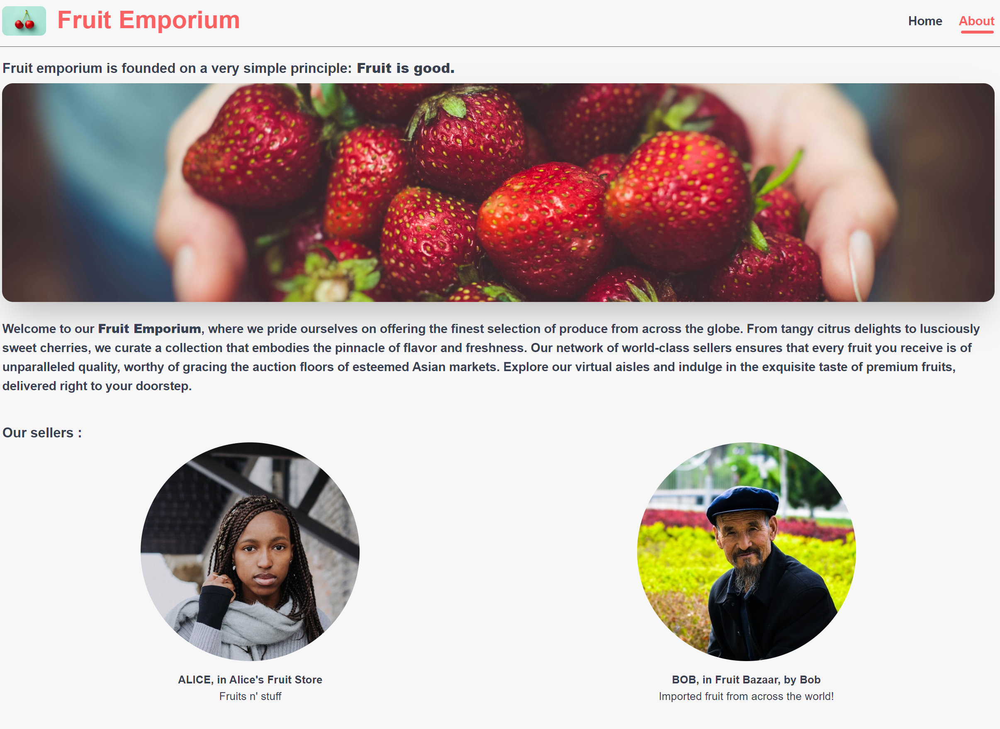
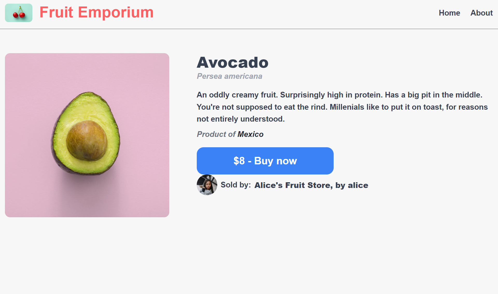

# The Fruit Emporium

---

In this workshop, I built an online fruit store, with different items being sold by different sellers.
It is only focused in client side.

- React
- Typescript
- Tailwind CSS

### Homepage:



### About page:



### Items page



---

### Page routing

```js
const router = createBrowserRouter([
  {
    path: '/',
    element: <App />,
    errorElement: <NotFound />,
    children: [
      {
        index: true,
        element: <Home />,
      },
      {
        path: '/about',
        element: <About />,
      },
      {
        path: '/:itemId',
        element: <ItemDetail />,
      },
      {
        path: '/confirm',
        element: <Confirmation />,
      },
    ],
  },
]);
```
